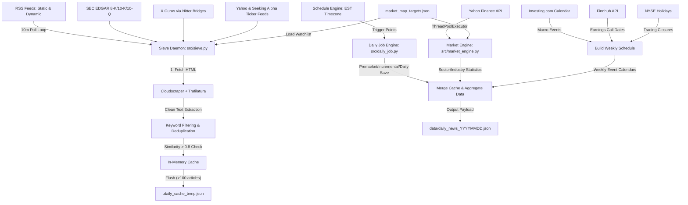

# Sieve: High-Performance News Scraper & Real-Time Market Data Pipeline 🛰️

[](https://opensource.org/licenses/MIT)
[](https://www.python.org/)
[](https://github.com/astral-sh/uv)
[](https://github.com/buddy-proiectio/sieve/pulls)

Sieve is an automated, production-ready news scraping, rule-based filtering, and market data aggregation engine designed to operate 24/7. It continuously scans financial and tech sectors, extracts full-text articles while bypassing anti-bot shields, performs semantic deduplication, and generates structured JSON outputs suitable for downstream LLMs, AI agents (like **Buddy**), and analytics dashboards.

Deployed as an independent background service, Sieve aligns strictly with the US Market hours and time zone (EST/EDT) to deliver precise daily and premarket data dumps.

---

## 🏗️ System Architecture

Sieve operates as a multi-threaded daemon that orchestrates feed polling, full HTML extraction, real-time market calculation, and calendar scheduling routines.



---

## 🌟 Key Features

- **Dynamic RSS & Atom Generation**: Monitors SEC EDGAR filings (`8-K`, `10-K`, `10-Q`), Seeking Alpha, Yahoo Finance, and X (Twitter) influencers via Nitter, dynamically customized for a watchlist of 100+ stock tickers.
- **Resilient Web Scraping**: Bypasses Cloudflare and other scraping protections using `cloudscraper` with random delays and Chrome emulation. Extracts high-quality article content using `trafilatura`.
- **Semantic Deduplication**: Drops duplicate articles automatically by evaluating title similarity via `SequenceMatcher` with an `0.8` similarity threshold.
- **Low-Memory Footprint Optimization**: Designed to run efficiently on low-cost 1GB RAM instances (e.g., Oracle Cloud free tier) by automatically flushing the memory cache to disk when it exceeds 100 items.
- **Concurrent Market Map Statistics**: Queries Yahoo Finance API concurrently utilizing Python's `ThreadPoolExecutor` to calculate real-time prices and changes. Stock details are grouped by GICS Sector and Industry with automatically calculated averages.
- **Weekly Financial Calendars**: Consolidates NYSE trading holidays (adjusting for observed days), corporate earnings calendars, and high/medium-impact macro indicators.

---

## 📂 Project Structure

```text
sieve/
├── src/
│   ├── sieve.py                # Main entry point; controls scheduling loop and RSS polling
│   ├── daily_job.py            # Event aggregation logic and daily saves (Incremental, Premarket, Daily)
│   ├── market_engine.py        # GICS-based real-time market map calculator using Yahoo Finance
│   ├── shared/
│   │   ├── __init__.py
│   │   ├── market_map_targets.json  # Configuration file containing monitored ticker metadata
│   │   └── shared_logger.py    # Log utility supporting console ANSI colors and UTF-8 file logging
│   └── __init__.py
├── data/
│   └── daily_news_YYYYMMDD.json # Periodic structured JSON outputs
├── logs/
│   └── sieve.log               # Application operational logs
├── pyproject.toml              # Project metadata and python dependencies managed via uv
└── README.md                   # Project documentation (This file)
```

---

## ⚙️ Configuration & Customization

### 1. Watchlist (Tickers)

Modify the monitored companies in `src/shared/market_map_targets.json`. Sieve will automatically update:

- Dynamic RSS feed targets for Yahoo, Seeking Alpha, and SEC EDGAR.
- GICS Sector/Industry clustering.
- Corporate earnings calendar.

Each entry should follow this structure:

```json
{
  "Symbol": "AAPL",
  "Company Name": "Apple",
  "GICS Sector": "Information Technology",
  "GICS Sub-Industry": "Technology Hardware, Storage & Peripherals",
  "Korean Name": "애플"
}
```

### 2. Targeting Keywords

Adjust target keywords and categories in `TARGET_KEYWORDS` defined inside `src/sieve.py`. The matching handles case-insensitivity and strict boundaries for acronyms.

---

## ⏰ Timezone & Scheduling Cycles

All schedule points are aligned with the US Eastern Time Zone (**America/New_York**).

| Job                    | Frequency / Execution Time (Local Time) | Role & Operational Details                                                                                                                                  |
| :--------------------- | :-------------------------------------- | :---------------------------------------------------------------------------------------------------------------------------------------------------------- |
| **News Scraping Loop** | Every `10 minutes`                      | Iterates over dynamic RSS feeds, processes text extraction, filters keywords, and caches matches.                                                           |
| **Incremental Save**   | Daily at `00:00` and `03:00`            | Saves currently cached articles to prevent data loss in case of server crashes (does not clear cache).                                                      |
| **Premarket Save**     | Daily at `08:30`                        | Merges the 06:00 AM dump with subsequent articles to form `premarket_news_YYYYMMDD.json` before market open.                                                |
| **Daily Save & Reset** | Daily at `06:00`                        | Merges memory/disk caches, fetches market maps and weekly calendars, writes the final `daily_news_YYYYMMDD.json`, and resets cache for the next 24hr cycle. |

_Note: Data saves only execute on US Trading Days (`is_us_trading_day` check). On weekends and NYSE holidays, saves are skipped and backlog is accumulated._

---

## 🛠️ Installation & Deployment

This project uses **[uv](https://github.com/astral-sh/uv)** for fast, reliable package and environment management.

### Prerequisites

Install `uv` if you haven't already:

```bash
# macOS/Linux
curl -LsSf https://astral.sh/uv/install.sh | sh
```

### Development Setup

```bash
# Clone the repository
git clone https://github.com/your-username/sieve.git
cd sieve

# Install dependencies and sync virtual environment
uv sync

# Copy the environment variable template and set up your API Key
cp .env.example .env
```

### Running the Application

Make sure you populate `FINNHUB_API_KEY` inside `.env` to enable corporate earnings schedule integration.

```bash
# Run the daemon in the foreground
uv run sieve
```

### Production Deployment (Systemd Service)

For production environments, it is recommended to run Sieve as a `systemd` daemon. You can use the following configuration template `/etc/systemd/system/sieve.service`:

```ini
[Unit]
Description=Sieve News & Market Scraper Daemon
After=network.target

[Service]
Type=simple
User=ubuntu
WorkingDirectory=/path/to/sieve
ExecStart=/home/ubuntu/.local/bin/uv run sieve
Restart=always
RestartSec=10
StandardOutput=syslog
StandardError=syslog
SyslogIdentifier=sieve

[Install]
WantedBy=multi-user.target
```

```bash
# Reload systemd and start service
sudo systemctl daemon-reload
sudo systemctl enable sieve
sudo systemctl start sieve
```

### 📦 Key External Dependencies

- `feedparser`: RSS and Atom feed deserializer
- `schedule`: Human-friendly job scheduling
- `cloudscraper`: Bypasses Cloudflare anti-bot checks
- `trafilatura`: Clean text extraction from HTML pages
- `holidays`: National and financial holiday tracker
- `pytz` & `python-dateutil`: Timezone conversions and ISO date parsing

---

## 📝 Output Schema Example

Below is an example of the structured payload stored in `data/daily_news_YYYYMMDD.json` created by `execute_daily_save_and_reset`:

```json
{
  "date": "2026-06-02 06:00 AM",
  "market_map": {
    "Indices": {
      "Dow Jones": { "price": "39,127.14", "change": "+0.15%" },
      "S&P 500": { "price": "5,277.51", "change": "-0.11%" },
      "Nasdaq": { "price": "16,735.02", "change": "-0.58%" },
      "Bitcoin": { "price": "67,482.10", "change": "+1.20%" }
    },
    "Sectors": {
      "Information Technology": {
        "sector_avg": "+0.45%",
        "industries": {
          "Semiconductors": {
            "industry_avg": "+1.12%",
            "details": {
              "NVDA": { "price": "1,096.33", "change": "+2.57%" },
              "AMD": { "price": "166.90", "change": "-0.32%" }
            }
          }
        }
      }
    }
  },
  "weekly_schedule": [
    {
      "currency": "USD",
      "importance": "holiday",
      "name": "Juneteenth National Independence Day",
      "korean_name": "준틴스 데이",
      "source_url": "",
      "utc_time": "2026-06-19T00:00:00Z"
    },
    {
      "currency": "USD",
      "importance": "high",
      "name": "CPI (MoM) (May)",
      "korean_name": "소비자물가지수 (전월대비) (5월)",
      "source_url": "https://www.investing.com/economic-calendar/cpi-69",
      "utc_time": "2026-06-12T12:30:00Z"
    },
    {
      "currency": "USD",
      "importance": "earnings",
      "name": "NVDA Earnings Call",
      "korean_name": "NVDA 실적 발표",
      "source_url": "",
      "utc_time": "2026-08-20T00:00:00Z"
    }
  ],
  "articles": [
    {
      "source": "TechCrunch AI",
      "title": "OpenAI signs content deal with major publishers",
      "url": "https://techcrunch.com/2026/06/02/openai-signs-content-deal",
      "published_at": "2026-06-02T10:15:00-04:00",
      "matched_keywords": ["OpenAI", "Microsoft"],
      "extraction_status": "success",
      "content": "Full article body extracted using trafilatura goes here..."
    }
  ]
}
```

---

## 🤝 Contributing

Contributions are welcome! Sieve is an open-source project and we love community feedback.

1. Fork the Project.
2. Create your Feature Branch (`git checkout -b feature/AmazingFeature`).
3. Commit your Changes (`git commit -m 'Add some AmazingFeature'`).
4. Push to the Branch (`git push origin feature/AmazingFeature`).
5. Open a Pull Request.

---

## 📄 License

Distributed under the MIT License. See [LICENSE](LICENSE) for more information.
